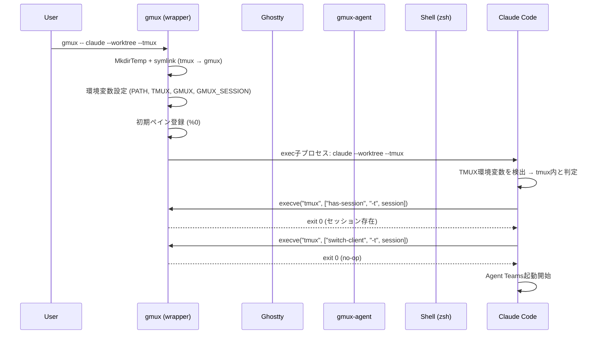
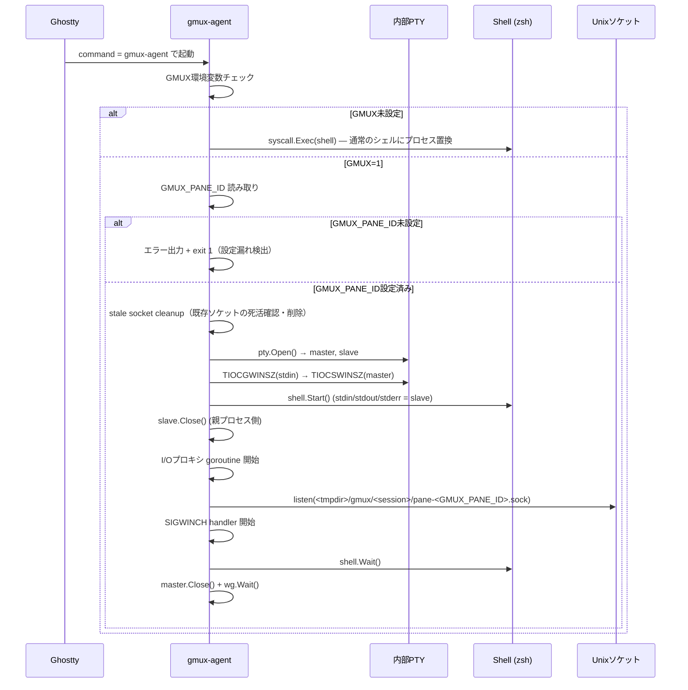
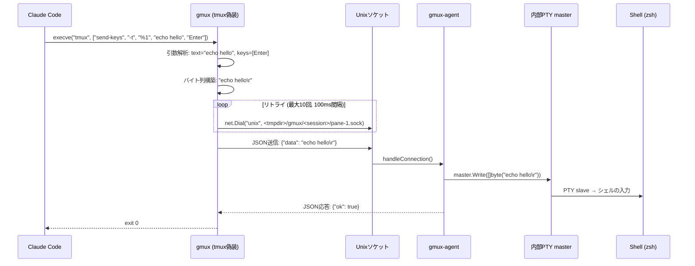

# gmux 設計書

## 1. プロジェクト概要

### 目的

gmuxは、Ghosttyターミナルエミュレータ上でClaude Code Agent Teams等のtmux依存ツールを動作させるためのtmux互換CLIラッパーである。

### スコープ

- tmux CLIインターフェースの互換エミュレーション（Claude Codeが使用するサブセット）
- Ghosttyのペイン・ウィンドウ・タブ操作のプログラマティック制御
- tmux偽装ラッパーモードによる透過的なツール統合

### ゴール

1. `gmux -- claude` でClaude CodeがGhostty上でtmux同等に動作する
2. Claude Codeが使用するtmuxコマンド群を網羅的にサポートする
3. 将来のghostty IPC拡充に追従できるモジュラーなアーキテクチャ
4. 将来のCustomPaneBackendプロトコルにも対応できる設計

### Claude Code `--tmux` フラグ（v2.1.49+）

Claude Code v2.1.49以降に `--tmux` フラグが追加された。これはgmuxの主要ターゲット。

```bash
claude --worktree --tmux          # iTerm2 native panes優先、なければtmux
claude --worktree --tmux=classic  # 従来のtmux CLI経由
```

- `--tmux` は `--worktree` との併用が必須
- iTerm2 native panesが利用可能ならそちらを優先使用
- `--tmux=classic` で従来のtmux CLIコマンド経由での操作を強制

#### 内部実行フロー

`--tmux` 指定時、`execIntoTmuxWorktree` はCLI引数解析のfast pathで実行される。これは通常のClaude Code起動フロー（設定読み込み、UI初期化等）より前の段階で処理される。

Design rationale: fast pathでの実行により、tmuxセッションの作成・接続はClaude Codeの本体ロジックが動く前に完了する。これはgmuxが偽装する`tmux`バイナリが高速に応答する必要があることを意味する。

#### Ghosttyでの自動classic化

Ghosttyでは `TERM_PROGRAM` が `iTerm.app` ではないため、`--tmux` を指定しても自動的にclassic相当の挙動になる（iTerm2 native panesの利用条件を満たさないため）。

**gmuxの想定利用フロー**:

```bash
gmux -- claude --worktree --tmux
```

Design rationale: Ghosttyユーザは `--tmux=classic` を明示する必要がない。`--tmux` だけでtmux CLI経由の操作になるため、コマンドがシンプルになる。

#### セッション名の生成ルール

`--tmux` 使用時にClaude Codeが生成するtmuxセッション名:

```
{repoName}_worktree-{worktreeName}
```

- `[^a-zA-Z0-9-]` に該当する文字は全て `_` に置換される（`~/.claude/projects/` のディレクトリ名生成と同様のパターン）
- 例: リポジトリ `gmux`、worktree名 `feature/new-cmd` → セッション名 `gmux_worktree-feature_new-cmd`
- 例: リポジトリ `my.app`、worktree名 `fix/v2.0` → セッション名 `my_app_worktree-fix_v2_0`

#### 環境変数

**Claude Code側が設定する環境変数**（gmuxは読み取りのみ）:

| 環境変数 | 説明 |
|----------|------|
| `CLAUDE_CODE_TMUX_SESSION` | 現在のtmuxセッション名 |
| `CLAUDE_CODE_TMUX_PREFIX` | tmuxのprefix key |
| `CLAUDE_CODE_TMUX_PREFIX_CONFLICTS` | prefix keyの競合情報 |

**gmux側が設定する環境変数**（ラッパーモードで子プロセスに継承される）:

| 環境変数 | 説明 |
|----------|------|
| `TMUX` | tmux互換の偽装値（`<socket_path>,<pid>,0`）。Claude Codeがtmux内であると認識するために必要 |
| `GMUX` | `1` — gmuxラッパーモード内であることを示す。gmux-agentのPTYプロキシモード起動判定に使用 |
| `GMUX_SESSION` | gmuxが生成したセッション名。gmux CLIプロセス間でセッション名を共有するために使用 |
| `GMUX_PANE_ID` | gmux-agentに割り当てられたペインID（初期ペイン用）。§3 ペインID伝達メカニズム参照 |
| `TMUX_PANE` | ペインID（`%0`, `%1`等）。tmux互換。ツールがペインIDを取得するために使用 |

**両者の関係**: Claude Codeは `TMUX` の存在を確認してtmuxセッション内と判断し、`CLAUDE_CODE_TMUX_*` 変数を設定した上でtmuxコマンド（=gmux）を呼び出す。gmuxは `GMUX_SESSION` でセッション名を解決し、ソケットパスの構築に使用する。

### セットアップ要件

gmuxの動作に必要な事前設定:

1. **バイナリ配置**: `gmux` と `gmux-agent` を `$PATH` の通ったディレクトリに配置する
2. **ghostty設定**: `~/.config/ghostty/config` に `command = gmux-agent` を追記する
3. **macOSアクセシビリティ権限**: System Eventsによるキーシミュレーションにアクセシビリティ権限が必要。初回実行時にmacOSの権限ダイアログが表示される
4. **gmux-agent未設定時のエラー**: ghosttyの `command` 設定に `gmux-agent` が指定されていない場合、send-keysが動作しない。gmuxは起動時にgmux-agentとの通信確認を行い、未設定の場合は以下のメッセージを出力する: `gmux: gmux-agent is not configured. Set 'command = gmux-agent' in ghostty config.`

### 非ゴール

- tmuxの完全互換（スクリプティング、フック、マウス操作等）
- tmux独自のセッション永続化機能の再現
- Ghostty以外のターミナルエミュレータ対応（将来の拡張として検討）

---

### 用語集

本設計書で使用する用語の定義。

| 用語 | 説明 |
|------|------|
| PTY (master/slave) | 疑似端末。masterはターミナルエミュレータ側、slaveはシェル/プロセス側のファイルディスクリプタ。`pty.Open()` でペアを作成する |
| ioctl | デバイスドライバに対する制御操作。PTYのウィンドウサイズ取得/設定等に使用する |
| TIOCSTI | "Terminal I/O Control Send Terminal Input"。他プロセスのTTYに文字を注入するioctl。macOS Ventura以降でブロックされている |
| TIOCGWINSZ | "Terminal I/O Control Get Window Size"。PTYのウィンドウサイズ（行数・列数）を取得するioctl |
| TIOCSWINSZ | "Terminal I/O Control Set Window Size"。PTYのウィンドウサイズを設定するioctl。設定後にSIGWINCHが送信される |
| SIGWINCH | ウィンドウサイズ変更シグナル。ターミナルサイズ変更時にフォアグラウンドプロセスグループに送られる |
| SIGHUP | ハングアップシグナル。ターミナル切断時や親プロセス終了時にセッションリーダーに送られる |
| SIGINT | 割り込みシグナル。Ctrl+Cで発生する |
| SIGTERM | 終了シグナル。プロセスの正常終了を要求する |
| execve / exec | プロセス置換。現在のプロセスイメージを新しいプログラムで置き換える。PIDは変わらない |
| flock | ファイルロック。複数プロセス間の排他制御に使用する |
| argv[0] | プログラム起動時の最初の引数。通常はプログラム名またはパス。symlinkの場合はリンク名が入る |
| System Events | macOSのアクセシビリティフレームワーク。osascript経由でアプリケーションにキーイベントを送信できる |
| keysim | gmux内のモジュール名。System Events経由でghosttyのキーバインドをシミュレートする |
| no-op | 何もしない操作。正常終了（exit 0）するが副作用を持たない |
| Unixドメインソケット | ファイルシステムパスを使用するプロセス間通信。ネットワークを経由しないため高速で、ファイルパーミッションで保護できる |
| NDJSON | Newline Delimited JSON。1行1JSONオブジェクトの形式。ストリーム処理に適する |
| JSON-RPC 2.0 | JSON形式のRPCプロトコル。CustomPaneBackendプロトコルで採用されている |

---

## 2. アーキテクチャ概要

### 全体構成図

```
┌──────────────────────────────────────────────────────────────────┐
│  Claude Code / tmux依存ツール                                    │
│  (tmuxバイナリを呼び出す)                                         │
└──────────┬───────────────────────────────────────────────────────┘
           │ execve("tmux", ["split-window", "-h", ...])
           ▼
┌──────────────────────────────────────────────────────────────────┐
│  gmux (argv[0]="tmux" via symlink)                              │
│  ┌────────────────────────────────────────────────────────────┐  │
│  │ cmd/gmux/  — CLIエントリーポイント・tmux互換引数パーサ       │  │
│  └──────┬─────────────────────────────────────────────────────┘  │
│         │                                                        │
│  ┌──────▼─────────────────────────────────────────────────────┐  │
│  │ internal/tmux/  — tmuxコマンド→内部アクション変換           │  │
│  │  ※ グローバルオプション→コマンド名→コマンド固有オプションの  │  │
│  │    3段階パース（詳細は §4 パーサ仕様を参照）                 │  │
│  └──────┬─────────────────────────────────────────────────────┘  │
│         │                                                        │
│  ┌──────▼─────────────────────────────────────────────────────┐  │
│  │ internal/ghostty/  — Controller インターフェース            │  │
│  │   └── keysim/     — macOS System Events 経由の操作          │  │
│  └──────┬─────────────────────────────────────────────────────┘  │
│         │                                                        │
│  ┌──────▼──────┐  ┌──────────────┐  ┌──────────────────────┐    │
│  │ pane/       │  │ wrapper/     │  │ logger/              │    │
│  │ ペイン状態  │  │ tmux偽装     │  │ ログ蓄積             │    │
│  └─────────────┘  └──────────────┘  └──────────────────────┘    │
│                                                                  │
│  ┌──────────────────────────────────────────────────────────────┐│
│  │ cmd/gmux-agent/  — PTYプロキシエージェント                    ││
│  │   ├── 内部PTY管理 (master/slave)                             ││
│  │   ├── I/Oプロキシ (ghostty PTY ⟷ 内部PTY)                   ││
│  │   ├── Unixソケットサーバ (send-keys受信)                      ││
│  │   └── SIGWINCH転送                                           ││
│  └──────────────────────────────────────────────────────────────┘│
└──────────────────────────────────────────────────────────────────┘
           │                              │
           ▼                              ▼
┌──────────────────────────┐  ┌─────────────────────────────────┐
│  Ghostty ターミナル       │  │  Unixソケット                    │
│  ├── System Events       │  │  <tmpdir>/gmux/<session>/       │
│  │   (ペイン操作)         │  │  (send-keys データ受信)          │
│  └── 各ペインで           │  └─────────────────────────────────┘
│      gmux-agent 起動      │
└──────────────────────────┘
```

### gmux-agent アーキテクチャ

各ペインにおけるgmux-agentの構成:

```
ghostty config: command = gmux-agent

各ペイン:
  ghostty PTY (master/slave)
    └── gmux-agent
        ├── 内部PTY (master/slave)
        │     └── zsh (実際のシェル)
        ├── I/Oプロキシ (ghostty PTY ⟷ 内部PTY)
        ├── Unixソケット (<tmpdir>/gmux/<session>/pane-<id>.sock)
        └── SIGWINCH転送
```

- gmux-agentは内部PTYを作成しシェルを起動
- 双方向I/Oプロキシでghosttyの表示とキー入力を透過的に中継
- Unixソケットでsend-keysデータを受け付け
- `master.Write(data)` で内部PTYに書き込み → シェルの入力になる
- SIGWINCH（ウィンドウサイズ変更）を内部PTYに転送

Design rationale: macOSではghostty CLI IPC (`ghostty +action`) は `+new-window` も含め全てのペイン操作が不可能。GTK/Linux限定の機能であるため、macOSバックエンドはSystem Events (keysim) でペイン操作、gmux-agentのPTYプロキシでsend-keysを実現する。クリップボード+ペースト方式は、クリップボード汚染、クリップボードマネージャへの秘密情報漏洩、flock排他制御の複雑さ、フォーカス移動の必要性などの問題があるため採用しない。

### レイヤー構成

| レイヤー | 責務 |
|----------|------|
| CLI層 | tmux互換の引数解析、argv[0]分岐 |
| コマンド変換層 | tmuxコマンド→内部アクションへのマッピング |
| バックエンド層 | ghosttyへの実操作（キーシミュレーションによるペイン操作） |
| エージェント層 | PTYプロキシによるsend-keys（gmux-agent） |
| 状態管理層 | ペインID管理、PTYマッピング |
| インフラ層 | ログ蓄積、設定管理 |

---

## 3. モジュール構成

```
github.com/kawaz/gmux/
├── cmd/
│   ├── gmux/           # CLIエントリーポイント
│   └── gmux-agent/     # PTYプロキシエージェント
├── internal/
│   ├── tmux/           # tmuxコマンド→内部アクション変換（3段階パーサ含む）
│   ├── ghostty/        # Controller インターフェース定義
│   │   └── keysim/     # macOS System Events 操作
│   ├── agent/          # gmux-agent コアロジック（PTYプロキシ、Unixソケット）
│   ├── pane/           # ペイン状態管理
│   ├── wrapper/        # tmux偽装ラッパーモード
│   └── logger/         # 呼び出しログ蓄積
└── docs/               # 設計文書
```

### 各パッケージの責務

#### `cmd/gmux/` — CLIエントリーポイント

- argv[0]による分岐（`tmux` として呼ばれたか `gmux` として呼ばれたか）
- tmux互換の引数解析（`-t %0`, `-h`, `-v`, `-P -F "#{pane_id}"` 等）
- `gmux -- <command>` によるラッパーモード起動

```go
// argv[0] 分岐の例
baseName := filepath.Base(os.Args[0])
if baseName == "tmux" {
    runAsGmux(os.Args[1:])  // tmux互換モード
    return
}
```

#### `cmd/gmux-agent/` — PTYプロキシエージェント

ghosttyの `command` 設定で各ペインに配置されるエージェントプロセス。

```go
func main() {
    // GMUX環境変数がなければ通常のシェルをexec（オーバーヘッドなし）
    if os.Getenv("GMUX") == "" {
        shell := getDefaultShell()
        if err := syscall.Exec(shell, []string{shell}, os.Environ()); err != nil {
            fmt.Fprintf(os.Stderr, "gmux-agent: failed to exec shell %s: %v\n", shell, err)
            os.Exit(1)
        }
        return
    }

    // GMUX_PANE_ID未設定はラッパーモードの設定漏れ — エラー終了
    if os.Getenv("GMUX_PANE_ID") == "" {
        fmt.Fprintf(os.Stderr, "gmux-agent: GMUX_PANE_ID is not set (GMUX=1 but no pane ID assigned)\n")
        os.Exit(1)
    }

    // TMUX_PANE環境変数を設定（tmux互換）
    paneID := os.Getenv("GMUX_PANE_ID")
    os.Setenv("TMUX_PANE", fmt.Sprintf("%%%s", paneID))

    // PTYプロキシモードで起動
    if err := agent.Run(); err != nil {
        fmt.Fprintf(os.Stderr, "gmux-agent: %v\n", err)
        os.Exit(1)
    }
}
```

Design rationale: `GMUX=1` 環境変数がある場合のみPTYプロキシモードで動作し、それ以外では通常のシェルを `exec` する。これにより、gmux-agentをghosttyの `command` に設定しても、gmuxラッパーモード外では一切のオーバーヘッドがない。

##### ペインID伝達メカニズム

ghosttyの `command = gmux-agent` は全ペインで同一コマンドが起動されるため、各gmux-agentインスタンスが自身のペインIDを知る仕組みが必要。

**方式: 環境変数 `GMUX_PANE_ID` による伝達（メインフロー）**

```
1. 初期ペイン（%0）:
   - gmuxラッパー起動時に GMUX_PANE_ID=0 を環境変数に設定
   - ghosttyの command = gmux-agent で起動されたgmux-agentが
     GMUX_PANE_ID を読み取り、自身のペインIDを確定
   - gmux-agentが TMUX_PANE=%0 を環境変数に設定（tmux互換）
   - ソケットパス: <tmpdir>/gmux/<session>/pane-0.sock

2. split-windowで作成される後続ペイン（%1, %2, ...）:
   - gmux CLIプロセス（split-window実行）がpane.Managerから次のIDを取得
   - GMUX_PANE_ID=<new_id> を環境変数に設定してからkeysimでsplit実行
   - ghosttyは親ペインの環境変数を子ペインに継承するため、
     新ペインのgmux-agentが GMUX_PANE_ID を取得できる
   - ソケットパス: <tmpdir>/gmux/<session>/pane-<new_id>.sock

   伝達経路の詳細:
   gmux CLIプロセス（split-windowコマンド実行中）が os.Setenv("GMUX_PANE_ID", newID) を呼ぶと、
   そのプロセスの環境変数が更新される。直後にkeysimでghosttyのsplit操作を実行すると、
   ghosttyは新ペインを作成し、`command = gmux-agent` で新プロセスを起動する。
   ghosttyは新ペインのプロセスを起動する際、**親ペインの環境を継承する**のではなく、
   ghosttyプロセス自体の環境を基に子プロセスの環境を構築する。

   したがって、gmux CLIプロセスの環境変数変更は直接新ペインには伝わらない。
   実際の伝達はフォールバック方式（自己登録）に依存する可能性が高い。
   Phase 1 PoCでghosttyの環境変数継承挙動を検証し、伝達メカニズムを確定する。

3. GMUX_PANE_ID未設定時:
   - gmux-agentはエラーメッセージを出力してexit 1で終了する
   - これはgmux-agentがGMUXラッパーモード外で誤って起動された
     設定漏れを検出するための安全策
```

**代替方式: gmux-agentによる自己登録（フォールバック）**

環境変数の継承が期待通りに動作しない場合のフォールバック方式。

```
1. gmux-agentが起動する（ペインIDはまだ不明）
2. gmux-agentがUnixソケットを一時パスで作成
   <tmpdir>/gmux/<session>/agent-<pid>.sock
3. gmux-agentがpane.Managerの状態ファイルに自身を登録要求
   - 状態ファイル: ~/.local/state/gmux/panes-<session>.json
   - 登録内容: PID, TTYデバイスパス, 一時ソケットパス
4. gmux本体（split-window等の実行プロセス）がTTY差分検出で新ペインを認識
   - 新ペインにペインID（%N）を割り当て
   - TTYとagent PIDの対応から一時ソケット→正式ソケットにrename
     <tmpdir>/gmux/<session>/pane-<id>.sock
5. gmux-agentは正式ソケットパスへのrename完了を検出してペインIDを確定
```

Design rationale: ghosttyは親ペインの環境変数を子ペインに継承するため、`GMUX_PANE_ID` による伝達が最もシンプルで確実。gmux CLIプロセスがsplit前に `GMUX_PANE_ID` を次のIDに設定し、環境変数の継承でgmux-agentに伝達する。自己登録方式はフォールバックとして残すが、Phase 1のPoC段階で環境変数継承の確実性を検証し、不要であれば除去する。GMUX_PANE_ID未設定時のエラー終了は、設定漏れの早期検出を目的とする。

#### `internal/tmux/` — tmuxコマンド→内部アクション変換

- tmuxのコマンドライン引数を解析し、内部アクションに変換
- 3段階パース: グローバルオプション → コマンド名 → コマンド固有オプション（詳細は §4 パーサ仕様を参照）
- `-t %N` によるペインターゲット指定の処理
- `-L <socket>` によるソケット指定の処理（外部swarmモード対応）
- フォーマット文字列（`#{pane_id}`, `#{session_name}` 等）の展開

#### `internal/ghostty/` — Controllerインターフェース

バックエンドを抽象化するインターフェース定義。

```go
type Controller interface {
    NewWindow() error
    NewTab() error
    NewSplit(direction SplitDirection) error
    GotoSplit(direction GotoDirection) error
    ResizeSplit(direction ResizeDirection, amount int) error
    CloseSurface() error
    ToggleSplitZoom() error
    EqualizeSplits() error
    // ... タブ操作等
}
```

Design rationale: ControllerはSystem Events経由のペイン操作（split, close, focus等）のみを担当する。send-keysはgmux-agentのPTYプロキシが担当するため、ControllerにSendTextは不要。これによりバックエンド実装（keysim/将来のCLI IPC）の差し替えが容易になる。

#### `internal/ghostty/keysim/` — macOS System Events操作

macOSではghostty CLI IPCで `+new-window` も含め全てのペイン操作が不可能なため、System Events経由のキーシミュレーションを使用する。

Design rationale: ghostty CLI IPC (`ghostty +action`) はGTK/Linux限定。macOSでは一切のペイン操作ができないため、System Events経由のキーシミュレーションが唯一の手段。

```go
// osascript で ghostty のキーバインドをトリガー
// セキュリティ: keystrokeとmodifiersは固定値マップから引く（§10 セキュリティ参照）
func (k *KeySim) sendKeyCombo(action Action) error {
    combo, ok := keyMap[action]
    if !ok {
        return fmt.Errorf("unknown action: %s", action)
    }
    script := fmt.Sprintf(
        `tell application "System Events" to tell process "ghostty" to keystroke "%s" using {%s}`,
        combo.Key, combo.Modifiers,
    )
    cmd := exec.Command("osascript", "-e", script)
    return cmd.Run()
}
```

ghosttyデフォルトキーバインド（macOS）との対応:

| 操作 | キーバインド | osascript |
|------|-------------|-----------|
| 新しいウィンドウ | `super+n` | `keystroke "n" using {command down}` |
| 新しいタブ | `super+t` | `keystroke "t" using {command down}` |
| 右に分割 | `super+d` | `keystroke "d" using {command down}` |
| 下に分割 | `super+shift+d` | `keystroke "D" using {command down, shift down}` |
| 前のペイン | `super+[` | `keystroke "[" using {command down}` |
| 次のペイン | `super+]` | `keystroke "]" using {command down}` |
| ペインを閉じる | `super+w` | `keystroke "w" using {command down}` |
| ズームトグル | `super+shift+enter` | `key code 36 using {command down, shift down}` |
| サイズ均等化 | `super+ctrl+=` | `keystroke "=" using {command down, control down}` |

Design rationale: keystrokeとmodifiersを固定値マップで管理することで、osascriptインジェクションを防止する。ユーザ入力は直接osascriptに渡さない。

#### `internal/agent/` — PTYプロキシ（gmux-agentコアロジック）

gmux-agentの中核ロジック。内部PTYの管理、I/Oプロキシ、Unixソケットサーバを提供する。

```go
type Agent struct {
    masterFd   *os.File           // 内部PTYマスター
    shell      *exec.Cmd          // シェルプロセス
    socketPath string             // Unixソケットパス
    listener   net.Listener       // ソケットリスナー
    paneID     string             // このペインのID
}
// Design rationale: slaveFdはシェルプロセス起動後に親プロセス側でCloseするため、
// Agent構造体には保持しない。保持し続けるとシェル終了時にEOFが正しく伝播しない。

func (a *Agent) Run() error {
    // 0. Stale socket cleanup
    //    前回のクラッシュ等で残った古いソケットファイルを検出・削除する。
    //    ソケットパスが既に存在する場合、connect試行で死活確認する。
    //    接続失敗（=前回のプロセスが死んでいる）なら削除して続行。
    //    接続成功（=別プロセスが稼働中）ならエラー終了。
    //
    // Design rationale: stale socket検出にはStat→Dial→Remove→Listenの間に
    // TOCTOU脆弱性が存在する。理想的には "listen first, remove-if-stale second"
    // パターンが望ましいが、net.Listen("unix", ...)は既存ファイルが存在すると
    // EADDRINUSEを返すため、先にDialで生死確認する現在のアプローチを採用する。
    // $TMPDIRがユーザ固有ディレクトリ（macOS: /var/folders/.../<uid>/T/）であるため、
    // 他ユーザからの攻撃リスクは実質的にない。同一ユーザ内のTOCTOUは許容する
    // トレードオフとする。
    if _, err := os.Stat(a.socketPath); err == nil {
        conn, dialErr := net.DialTimeout("unix", a.socketPath, 500*time.Millisecond)
        if dialErr != nil {
            // 古いソケット — 削除して続行
            os.Remove(a.socketPath)
        } else {
            conn.Close()
            return fmt.Errorf("socket %s is already in use by another process", a.socketPath)
        }
    }

    // 1. 内部PTY作成
    master, slave, err := pty.Open()
    if err != nil {
        return fmt.Errorf("failed to open pty: %w", err)
    }

    // 2. 起動時のウィンドウサイズ同期
    //    ghostty PTY (stdin) のサイズを内部PTYに反映
    if ws, err := unix.IoctlGetWinsize(int(os.Stdin.Fd()), unix.TIOCGWINSZ); err == nil {
        unix.IoctlSetWinsize(int(master.Fd()), unix.TIOCSWINSZ, ws)
    }

    // 3. シェル起動（内部PTYスレーブをstdin/stdout/stderrに接続）
    // getDefaultShell: $SHELL環境変数を使用。
    // $SHELLはOSのログインシェル設定に基づく値であり、
    // gmux-agentはユーザランドで動作するため信頼できる。
    shell := exec.Command(getDefaultShell())
    shell.Stdin = slave
    shell.Stdout = slave
    shell.Stderr = slave
    shell.SysProcAttr = &syscall.SysProcAttr{
        Setsid:  true,             // 新しいセッションを作成
        Setctty: true,             // 制御端末を設定
        Ctty:    int(slave.Fd()),  // macOS: 親プロセス内のfd番号を指定
    }
    // 注意: Linux では Ctty は子プロセス内のfd番号（通常0=stdin）を指定する。
    // macOS (Darwin) では親プロセス内のfd番号を指定する。
    // Go の os/exec は Stdin/Stdout/Stderr に設定したfdを子プロセスの
    // fd 0/1/2 にdup2するが、Ctty の解釈はOS依存。
    //
    // ⚠ Go 1.20+ ではos/execのfd管理が変更され、ExtraFiles以外のfdに
    // O_CLOEXECが設定される可能性がある。slave.Fd()の値がexec後に
    // 無効になるリスクがあるため、creack/pty の StartWithAttrs を
    // 使用することを推奨する。StartWithAttrs はPTYのfd管理と
    // SysProcAttr.Ctty設定を安全に処理する。
    if err := shell.Start(); err != nil {
        slave.Close()
        master.Close()
        return fmt.Errorf("failed to start shell: %w", err)
    }

    // 4. 親プロセス側のslave fdを閉じる（シェルプロセスが起動した後は不要）
    slave.Close()
    // これ以降、slave fdは子プロセス（シェル）のみが保持する。
    // 親が保持し続けるとシェル終了時にEOFが正しく伝播しない。

    // 5. I/Oプロキシ開始
    //    ghostty PTY stdin → 内部PTY master (Write)
    //    内部PTY master (Read) → ghostty PTY stdout
    var wg sync.WaitGroup
    wg.Add(2)
    go func() {
        defer wg.Done()
        io.Copy(master, os.Stdin)   // ユーザ入力 → シェル (stdinのEOFで終了)
    }()
    go func() {
        defer wg.Done()
        io.Copy(os.Stdout, master)  // シェル出力 → 画面表示 (masterのEIO=シェル終了で終了)
    }()

    // 6. Unixソケットサーバ開始（send-keys受信用）
    // ソケットファイルのパーミッション保護:
    // net.Listen("unix", ...) はumaskに従ったパーミッションでソケットを作成する。
    // 安全のためlisten前にumask(0077)を設定し、listen後に復元する。
    oldUmask := syscall.Umask(0077)
    a.startSocketServer()
    syscall.Umask(oldUmask)

    // 7. SIGWINCH転送
    //    ghostty PTYのサイズ変更を内部PTYに転送
    //    sigChはシャットダウンシーケンスでsignal.Stop + closeにより終了させる
    sigCh := a.handleSIGWINCH()

    // 8. シャットダウンシーケンス:
    // 1. shell.Wait() → シェルが終了
    // 2. listener.Close() → Acceptループ終了
    // 3. signal.Stop(sigCh) + close(sigCh) → SIGWINCHハンドラ停止
    // 4. master.Close() → io.Copy goroutinesがEIO/read errorで終了
    //    ※ io.Copy(master, os.Stdin)はos.StdinがEOFにならないが、
    //      master.Close()によりwrite先がクローズされEIOエラーで終了
    // 5. wg.Wait() → 全goroutine完了を待つ
    // 6. ソケットファイル削除
    err = shell.Wait()
    a.listener.Close()    // Acceptループ終了
    signal.Stop(sigCh)    // SIGWINCHハンドラ停止
    close(sigCh)
    master.Close()        // masterを閉じるとio.Copyがエラー(EIO)で終了する
    wg.Wait()             // I/Oプロキシgoroutineの完了を待つ（出力のflush保証）
    os.Remove(a.socketPath) // ソケットファイル削除
    return err
}
```

##### Unixソケットプロトコル

send-keysデータの受信にJSON-over-Unixソケットを使用する。

**プロトコル仕様**:
- **1リクエスト1接続方式**: クライアントはリクエストごとに新しいUnixソケット接続を確立し、レスポンス受信後に切断する。持続接続は使用しない
- **メッセージデリミタ**: JSON Encoder/Decoderが改行（`\n`）で区切るが、接続の切断がメッセージ境界を兼ねる。1接続で送受信されるJSONオブジェクトはそれぞれ1個のみ
- **エンコーディング**: UTF-8

ソケットパス: `<tmpdir>/gmux/<session>/pane-<id>.sock`

`<tmpdir>` は `os.TempDir()` の返す値（`$TMPDIR` 環境変数、macOSでは `/var/folders/.../<uid>/T/`）。macOSの `$TMPDIR` はユーザ固有のディレクトリを指すため、他ユーザのプロセスからのアクセスがOS レベルで分離される。

**Unixソケットパス長制限**: macOSでは `sun_path` の最大長が104バイト（`sizeof(struct sockaddr_un.sun_path)`）。`$TMPDIR` のパス自体が長い（例: `/var/folders/xx/xxxxxxxxxxxxxxxxxxxxxxxxxxxxxxxx/T/`で約50バイト）ため、セッション名が長い場合にパス長を超過する可能性がある。対策として:

1. ソケットパス構築時に104バイトを超える場合はエラーを返す（バリデーション）
2. 超過時はセッション名をSHA-256の先頭16文字にハッシュ化してパスを短縮する
3. ハッシュ化した場合、元のセッション名との対応は状態ファイルで管理する

```go
// send-keysリクエスト
type SendKeysRequest struct {
    Data string `json:"data"` // PTYに書き込むテキスト
}

// send-keysレスポンス
type SendKeysResponse struct {
    OK    bool   `json:"ok"`
    Error string `json:"error,omitempty"`
}
```

gmux CLIからの接続:

```go
// gmux send-keys -t %1 "echo hello" Enter の処理フロー
func sendKeys(paneID string, data string) error {
    sessionName := os.Getenv("GMUX_SESSION")

    // GMUX_SESSION バリデーション:
    // - 空文字列でないこと
    // - パス区切り文字（'/', '\'）が含まれていないこと（パストラバーサル防止）
    // - 最大長制限: ソケットパス長制約（macOS sun_path=104バイト）から逆算し、
    //   os.TempDir() + "/gmux/" + sessionName + "/pane-NNN.sock" が104バイト以内
    if sessionName == "" {
        return fmt.Errorf("GMUX_SESSION is not set")
    }
    if strings.ContainsAny(sessionName, "/\\") {
        return fmt.Errorf("GMUX_SESSION contains invalid path separator: %q", sessionName)
    }
    if !validSessionName.MatchString(sessionName) {
        return fmt.Errorf("GMUX_SESSION contains invalid characters: %q", sessionName)
    }

    socketPath := filepath.Join(os.TempDir(), "gmux", sessionName, fmt.Sprintf("pane-%s.sock", paneID))

    conn, err := net.Dial("unix", socketPath)
    if err != nil {
        return fmt.Errorf("pane %s not reachable: %w", paneID, err)
    }
    defer conn.Close()

    req := SendKeysRequest{Data: data}
    if err := json.NewEncoder(conn).Encode(req); err != nil {
        return err
    }

    var resp SendKeysResponse
    if err := json.NewDecoder(conn).Decode(&resp); err != nil {
        return err
    }
    if !resp.OK {
        return fmt.Errorf("send-keys failed: %s", resp.Error)
    }
    return nil
}
```

gmux-agent側の受信処理:

```go
// ソケットサーバ制限値:
// - 同時接続数: 最大16（超過時は接続拒否）
// - リクエストサイズ: 最大1MB（io.LimitReader）
// - 接続タイムアウト: 5秒（SetReadDeadline/SetWriteDeadline）

func (a *Agent) handleConnection(conn net.Conn) {
    defer conn.Close()

    // 接続タイムアウト設定
    conn.SetReadDeadline(time.Now().Add(5 * time.Second))
    conn.SetWriteDeadline(time.Now().Add(5 * time.Second))

    var req SendKeysRequest
    // リクエストサイズ制限: 1MB
    limitedReader := io.LimitReader(conn, 1<<20)
    if err := json.NewDecoder(limitedReader).Decode(&req); err != nil {
        sendError(conn, err)
        return
    }

    // 内部PTYマスターに書き込み → シェルの入力になる
    // Design rationale: PTYマスターFDへの並行Write（io.Copyとsend-keys）は
    // カーネルレベルでアトミック（PIPE_BUF以下のwrite(2)はアトミック保証）。
    // ただしPTYのwrite(2)がPIPE_BUFと同じ保証を持つかはOS依存のため、
    // 実装時にsync.Mutexでの保護を検討する。設計段階では明示的なロックなしで進める。
    if _, err := a.masterFd.Write([]byte(req.Data)); err != nil {
        sendError(conn, err)
        return
    }

    if err := json.NewEncoder(conn).Encode(SendKeysResponse{OK: true}); err != nil {
        // レスポンス送信失敗はログのみ（データは既にPTYに書き込み済み）
        log.Printf("failed to send response: %v", err)
    }
}
```

##### SIGWINCH転送

```go
// handleSIGWINCH はSIGWINCHシグナルを監視し、内部PTYにウィンドウサイズを転送する。
// 返されるsigChはRun()のシャットダウンシーケンスでsignal.Stop(sigCh) + close(sigCh)
// を呼び出すことでgoroutineを安全に終了させる。
func (a *Agent) handleSIGWINCH() chan os.Signal {
    sigCh := make(chan os.Signal, 1)
    signal.Notify(sigCh, syscall.SIGWINCH)
    go func() {
        for range sigCh {
            // ghostty PTY (stdin) の現在のウィンドウサイズを取得
            ws, err := unix.IoctlGetWinsize(int(os.Stdin.Fd()), unix.TIOCGWINSZ)
            if err != nil {
                continue
            }
            // 内部PTYマスターにサイズを設定 → slave側のシェルにSIGWINCHが伝播
            unix.IoctlSetWinsize(int(a.masterFd.Fd()), unix.TIOCSWINSZ, ws)
        }
        // signal.Stop(sigCh) + close(sigCh) により for range が終了し、
        // goroutineは自然に終了する
    }()
    return sigCh
}
```

Design rationale: ghosttyがターミナルをリサイズすると、gmux-agentのstdin（ghostty PTYのslave）にSIGWINCHが送られる。gmux-agentはこれを受けてghostty PTYのサイズをTIOCGWINSZで取得し、内部PTYマスターにTIOCSWINSZで設定する。これにより内部PTYのslave側で動作するシェルにもSIGWINCHが自動的に伝播し、シェルやcurses系アプリケーションがリサイズに追従できる。起動時の初期サイズ同期はRun()内のステップ2で行う。

##### send-keysの利点

PTYプロキシ方式はクリップボード汚染なし、秘密情報漏洩リスクなし、排他制御不要、フォーカス移動不要。tmux/zellijと同じ実績ある方式。ghosttyの`command`設定変更が必要だが、それ以外のデメリットなし。不採用方式の詳細比較は `docs/archives/rejected-alternatives.md` を参照。

#### `internal/pane/` — ペイン状態管理

ghosttyにはペインIDの外部APIがないため、gmux側でペインID→PTYデバイスの対応を内部管理する。

```go
type Pane struct {
    ID       string // tmux互換のペインID（%0, %1, ...）
    TTY      string // PTYデバイスパス（/dev/ttys001 等）
    Active   bool   // フォーカス中か
    Width    int
    Height   int
    Socket   string // gmux-agentのUnixソケットパス
}

type Manager struct {
    panes    map[string]*Pane   // ID → Pane
    nextID   int
    stateDir string             // 状態ファイル保存先
}
```

状態ファイル: `~/.local/state/gmux/panes-<session-id>.json`（セッションごとに分離）

パーミッション: ファイル `0600`、ディレクトリ `0700`。ペイン状態にはTTYデバイスパスやソケットパス等が含まれるため、他ユーザからのアクセスを防止する。

Design rationale: tmuxコマンドは毎回独立プロセスとして起動されるため、プロセス間で状態（ペインID、アクティブペイン等）を共有する手段が必要。ファイルベースを選択した理由: (1) シンプルで実装が容易、(2) 外部依存なし（標準ライブラリのみ）、(3) デバッグしやすい（JSONファイルを直接確認可能）。代替案の検討結果: SQLiteは単純なキーバリュー管理に対して過剰、名前付きパイプはプロセスのライフサイクル管理が複雑、共有メモリ（shm）はポータビリティに難がある。

ペイン検出戦略:
- **split時**: split前後の `/dev/ttys*` 差分で新ペインを検出
- **close時**: PTYの消失（`stat` 失敗）で検出
- **定期ポーリング**: ペイン状態の整合性チェック

macOSでのPTY列挙方法:

```bash
# ghosttyプロセスが使用中のTTYのみを列挙する
lsof -c ghostty | grep /dev/ttys
```

`/dev/ttys*` の全列挙ではなく、`lsof -c ghostty` でghosttyが使用中のTTYに絞り込むことで、無関係なプロセスのTTYとの誤検出を防止する。split前後でこのコマンドの出力差分を取ることで、新ペインのTTYを正確に特定できる。

#### アクティブペインの追跡

- `goto_split` 実行時にアクティブペインIDを更新する
- `split-window` 実行時、新ペインがアクティブになる
- 初期状態ではラッパー起動元のペイン（%0）がactive

Design rationale: ghosttyにはアクティブペインを外部から問い合わせるAPIがない。操作のタイミングでgmux側の状態を更新し、`#{pane_active}` フォーマット変数に反映する。

#### `internal/wrapper/` — tmux偽装ラッパーモード

```
gmux -- claude
  │
  ├── 一時ディレクトリに gmux→tmux シンボリックリンク作成
  ├── PATH の先頭にそのディレクトリを追加
  ├── TMUX=<tmpdir>/gmux,<PID>,0 を設定
  ├── GMUX=1 を設定
  ├── GMUX_SESSION=<生成したセッション名> を設定
  ├── GMUX_PANE_ID=0 を設定
  ├── TMUX_PANE=%0 を設定（tmux互換）
  ├── セッション名を生成・記録（has-session用）
  ├── 初期ペインを登録（現在のTTYを%0として）
  └── 子プロセス起動
       └── claude が tmux split-window -h を呼ぶ
            └── 実際には gmux が実行され ghostty を操作
```

#### `internal/logger/` — 呼び出しログ蓄積

全tmuxコマンド呼び出しを記録し、未対応コマンドの継続的な対応改善に活用する。

**ログ書き込み失敗時の方針**: ログ書き込み失敗はstderrに警告を出力し、メイン処理を中断しない。ログはベストエフォートで記録する。gmuxの主要機能（tmuxコマンドの変換・実行）がログ障害で停止してはならない。

**send-keysデータのログマスク方針**: send-keysのデータ部分にはパスワードやAPIキー等の秘密情報が含まれる可能性がある。ログにはデータ部分を記録しない（`args` フィールドにはコマンド引数のみ記録し、結合後のデータバイト列は除外する）。デバッグ時には環境変数 `GMUX_LOG_DATA=1` で有効化可能とする。

**ログファイルパーミッション**: ログファイルは `0600`（所有者のみ読み書き）で作成する。ログディレクトリは `0700`。

```go
type Entry struct {
    Timestamp   time.Time `json:"timestamp"`
    Command     string    `json:"command"`
    Args        []string  `json:"args"`
    CallerPID   int       `json:"caller_pid"`
    CallerName  string    `json:"caller_name"`
    ExitCode    int       `json:"exit_code"`
    Error       string    `json:"error,omitempty"`
    Unsupported bool      `json:"unsupported,omitempty"`
}
```

---

## 4. tmux互換レイヤー — 対応コマンド一覧

Claude Codeバイナリ解析結果に基づく優先度付け。

### パーサ仕様: 3段階パース

tmuxのコマンドラインは以下の3段階で解析する:

```
tmux [グローバルオプション] <コマンド名> [コマンド固有オプション]
```

**段階1: グローバルオプション**

コマンド名の前に置かれるオプション。以下を認識する:

| オプション | 引数 | 説明 |
|-----------|------|------|
| `-L <name>` | あり | ソケット名（gmuxでは記録して無視） |
| `-S <path>` | あり | ソケットパス（gmuxでは記録して無視） |
| `-f <file>` | あり | 設定ファイル（gmuxでは無視） |
| `-V` | なし | バージョン表示（コマンドなしの場合） |

```bash
# 実例: Claude Code外部swarmモード
tmux -L claude-swarm split-window -h
#     ^^^^^^^^^^^^^^^^ グローバルオプション
#                      ^^^^^^^^^^^^ コマンド名
#                                   ^^ コマンド固有オプション
```

**段階2: コマンド名の特定**

グローバルオプションを消費した後の最初の非オプション引数がコマンド名。

**段階3: コマンド固有オプション**

コマンドごとに定義されたオプションを解析。各コマンドの対応オプションは Phase 表を参照。

Design rationale: Claude Codeは `-L claude-swarm` のようにグローバルオプション付きでtmuxを呼ぶことがある。コマンド名の前にグローバルオプションが来ることを想定しないとパースに失敗する。

**相反フラグの後勝ちルール**: 相反するフラグ（`-h`/`-v`等）が同時に指定された場合は後勝ち（last-wins）とする。tmux互換の挙動。

```bash
# 例: -h と -v の両方が指定された場合
tmux split-window -h -v   # → -v が後勝ちで垂直分割（下方向）
tmux split-window -v -h   # → -h が後勝ちで水平分割（右方向）
```

**`-t` ターゲット形式の解析**

`-t` オプションで指定されるターゲットは以下の形式を受け付ける:

| 形式 | 解析方法 | 例 |
|------|----------|-----|
| `%N` | ペインID直接指定 | `-t %0` → ペイン%0 |
| `session:window.pane` | pane部分を%N変換。session/windowは無視 | `-t gmux:0.1` → ペイン%1 |
| `session:window` | そのウィンドウの最初のペイン | `-t gmux:0` → ペイン%0 |
| `session` | セッション全体（=gmux環境全体） | `-t gmux` → セッション指定 |

Design rationale: Claude Codeは主に `%N` 形式でペインを指定するが、`session:window.pane` 形式も使用する場合がある。gmuxではセッションとウィンドウは単一のため、pane部分のみを有効に解析し、session/windowは存在確認のみ行う。

### Claude Codeが実行するtmuxコマンドパターン

#### `--tmux` fast pathで実行されるコマンド

```bash
# tmux内（TMUX環境変数あり = gmuxラッパーモード）
tmux has-session -t {session} 2>/dev/null
tmux switch-client -t {session}

# tmux外（通常はこちらにはならないが念のため）
tmux new-session -A -s {session} -c {worktreePath} -- {claudeBinary} {args}
```

Design rationale: gmuxラッパーモードではTMUX環境変数が常にセットされるため、fast pathは「tmux内」のパスを通る。`has-session` + `switch-client` の2コマンドをサポートすればよい。ただし `new-session` もフォールバックとして対応が必要。

#### Agent Teamsが使うコマンド

```bash
tmux show-options -g prefix              # prefix key取得
tmux new-window -t {session} -n teammate-{name} -P -F "#{pane_id}"
tmux send-keys -t {session}:{window} "command" Enter
tmux split-window -h -t {session} -P -F "#{pane_id}"
tmux select-pane -t {session}:0.0
tmux select-pane -t %0 -P "bg=#282828" -T "agent-1"
```

### Phase 1（MVP）— Claude Code基本動作に必須

全コマンド `-t %N` によるペインターゲット指定に対応する。`-P -F "#{pane_id}"` によるペインID出力にも対応する。

| tmuxコマンド | gmuxでの実装 | 状態 |
|-------------|-------------|------|
| `has-session` | セッション名一致チェック（§4 has-session詳細参照） | 未実装 |
| `switch-client` | no-op（exit 0を返す）（§4 switch-client詳細参照） | 未実装 |
| `new-session` | 既存ウィンドウ/ペインにフォーカス移動（§4 new-session詳細参照） | 未実装 |
| `show-options` | `prefix C-b\n` を返す（§4 show-options詳細参照） | 未実装 |
| `split-window` | keysimでnew_split + ペイン登録。`-h`/`-v`/`-t`/`-l`/`-P`/`-F` 対応（`-l`の扱いは下記参照） | 未実装 |
| `send-keys` | PTYプロキシ方式（gmux-agentのUnixソケット経由）。`-t`/`-l` 対応 | 未実装 |
| `select-pane` | keysimでgoto_split。`-t` 対応。`-P`/`-T` は認識して無視（警告なし） | 未実装 |
| `kill-pane` | keysimでclose_surface + ペイン削除。`-t` 対応 | 未実装 |
| `list-panes` | ペイン一覧をtmux互換フォーマットで返す。`-F` 対応 | 未実装 |
| `display-message` | フォーマット変数エミュレート。`-p`/`-t` 対応。`-p`なしはno-op（何も出力しない、exit 0） | 未実装 |
| `new-window` | keysimでnew_window。`-t`/`-n`/`-P`/`-F` 対応。split-windowと同様のPTY差分検出でペインIDを管理する | 未実装 |

Design rationale: `-t %N` はClaude Codeの全コマンドで使われるため、MVPから必須。`-P -F "#{pane_id}"` はAgent Teamsが `split-window`/`new-window` の結果から新ペインIDを取得するために必要。`select-pane -P`（ペイン背景色）と `-T`（ペインタイトル）はPhase 1では視覚効果のみのため、認識して無視する。Phase 2で対応を検討。

### Phase 2 — 完全なClaude Code対応

| tmuxコマンド | gmuxでの実装 | 状態 |
|-------------|-------------|------|
| `resize-pane` | keysimでresize_split | 未実装 |
| `list-windows` | ウィンドウ一覧エミュレート | 未実装 |
| `list-sessions` | セッション一覧エミュレート | 未実装 |
| `select-layout` | equalize_splits等にマッピング | 未実装 |
| `select-pane -P/-T` | ペイン背景色・タイトル対応 | 未実装 |

### Phase 3 — 拡張コマンド

| tmuxコマンド | gmuxでの実装 | 状態 |
|-------------|-------------|------|
| `attach-session` | no-op（常にattach状態） | 未実装 |
| `set-option` | 対応可能なオプションのみ | 未実装 |
| `break-pane` | 新ウィンドウに移動 | 未実装 |
| `join-pane` | 未対応（警告出力） | 未実装 |

### 未対応コマンドのエラーハンドリング方針

未対応のtmuxコマンドが呼ばれた場合の挙動:

1. **stderr**: 警告メッセージを出力 — `gmux: unsupported tmux command: <command>`
2. **exit code**: 0（正常終了）
3. **ログ**: `unsupported: true` フラグ付きで記録

Design rationale: exit 0で正常終了させることで、ツール側（Claude Code等）のエラーハンドリングによるフロー中断を回避する。未対応コマンドはログに記録されるため、継続的に対応改善のフィードバックが得られる。stderrへの警告出力はデバッグ用途であり、ツール側は通常stderrを無視するため影響がない。

### コマンド詳細仕様

#### `has-session` — セッション存在確認

wrapper起動時に生成したセッション名を記録する。`has-session -t <name>` で指定されたセッション名が記録値と一致すればexit 0、不一致ならexit 1を返す。

```go
func HasSession(targetSession string) int {
    if targetSession == currentSessionName {
        return 0
    }
    return 1
}
```

Design rationale: gmuxには「セッション」の概念が薄いが、Claude Codeのfast pathは `has-session` でセッション存在を確認してから `switch-client` を呼ぶ。セッション名を正しくチェックすることで、異なるセッション名での誤マッチを防ぐ。

Design rationale: tmuxの `has-session` は引数なし（`-t`未指定）の場合、カレントセッションを暗黙のターゲットとして扱う。gmuxではラッパーモード内で常に単一セッションが存在するため、引数なしでも exit 0 を返す。Claude Codeは `has-session -t {session}` と `-t` 付きで呼ぶため、引数なしのケースは通常発生しないが、安全側としてexit 0を返す。

#### `has-session` 失敗時のフォールバック

`has-session` がexit 1を返した場合、Claude Codeは `new-session` にフォールバックする。gmuxの対応フロー:

1. `has-session -t <name>`: セッション名不一致 → exit 1
2. Claude Codeが `new-session -A -s <name>` を発行
3. gmuxが `new-session` を受信 → セッション名を更新し、`new_window`（keysim）で新ウィンドウを作成

#### `select-pane` — ペインフォーカス移動

- `-t %N`: 指定ペインにフォーカス移動（§4 フォーカス移動アルゴリズム参照）
- `-U`/`-D`/`-L`/`-R`: 方向指定でフォーカス移動
- 引数なし: no-op（exit 0）。現在のペインを維持する
- `-P <style>`: Phase 1では認識して無視（警告なし）。Phase 2で対応
- `-T <title>`: Phase 1では認識して無視（警告なし）。Phase 2で対応

Design rationale: 引数なしの`select-pane`はtmuxではカレントペインを選択する（実質no-op）。gmuxでも同様にno-opとしexit 0を返す。`-P`/`-T`はPhase 1では視覚効果のみのため無視するが、ツール側のエラーを回避するため警告は出さない。

#### `split-window -l` — サイズ指定の対応方針

- Phase 1: `-l` オプション（例: `-l 70%`）は認識するがサイズ指定は無視し、splitのみ実行する。ログに `"ignored_option": "-l 70%"` として記録する
- Phase 2: split後に`resize_split`（keysim）で近似的にサイズ調整を行う。パーセント指定はターミナル全体のサイズから計算する

Design rationale: ghosttyのkeysimではsplit時にサイズを指定することが不可能。splitはデフォルトで50:50分割となる。Phase 2でresize_splitを組み合わせることで近似的にサイズ調整が可能だが、正確なピクセル/行数指定は困難なため「近似」にとどまる。Claude Codeのエージェント用途では厳密なサイズ指定は不要なため、実用上の問題は小さい。

#### `switch-client` — セッション切り替え

gmuxではno-op（exit 0を返す）。

Design rationale: Claude Codeの`--tmux` fast pathでは `has-session` 成功後に `switch-client` で「既存セッションに接続」する流れ。gmuxは既にGhosttyペイン内で動いているため、switch-clientは何もする必要がない。セッションの切り替え先は既に目の前に表示されている。

#### `new-session` — セッション作成

```bash
tmux new-session -A -s {session} -c {worktreePath} -- {claudeBinary} {args}
```

- `-A`: 常に「既存ウィンドウ/ペインにフォーカスを移す」として処理。gmuxにはセッションの「存在」の概念が薄いため、`-A` は「あれば接続」ではなく「既存環境にフォーカス」の意味で処理する
- `-s <name>`: セッション名を記録（has-session用）
- `-c <dir>`: カレントディレクトリとして記録するが、ghosttyの新ペイン/ウィンドウでは反映方法がないため実質無視
- `--` 以降の引数: 新ペインで実行するコマンド。ghosttyの `command` 設定相当だが、既存ペインへの適用は不可能なためPhase 2以降で検討

Design rationale: gmuxラッパーモードでは通常 `has-session` + `switch-client` のパスが使われるため、`new-session` はフォールバック。`-c` のカレントディレクトリ反映はghosttyの制約上不可能だが、ラッパー起動時のCWDが通常正しいため実害はない。

#### `show-options` — オプション取得

```bash
tmux show-options -g prefix
```

tmux互換のフォーマットで出力する:

```
prefix C-b
```

末尾に改行（`\n`）を含む。

フラグごとの挙動:

| フラグ | 挙動 |
|--------|------|
| `-g` | グローバルオプションを返す（`prefix C-b\n`等） |
| `-v` | 値のみ出力（`C-b\n`等、オプション名を省略）。`-g`等と組み合わせ可能（`-gv`） |
| なし | `-g` と同じ出力を返す（gmuxにセッションスコープの概念がないため） |
| `-s` | `-g` と同じ出力を返す |
| `-w` | `-g` と同じ出力を返す |
| 未知オプション名 | 空出力 + exit 0 |

`-v`フラグの出力例:
```bash
# -v なし
tmux show-options -g prefix  → "prefix C-b\n"

# -v あり
tmux show-options -gv prefix → "C-b\n"
```

Design rationale: Claude CodeはAgent Teams起動時に `show-options -gv prefix` でprefix keyを取得する。`-v`フラグにより値のみが返るため、パースが容易になる。gmuxではtmux互換の `C-b` を返す。gmuxにはセッション/ウィンドウスコープの概念がないため、`-g`/`-s`/`-w`/フラグなしは全て同じ出力を返す。

#### `list-panes` — ペイン一覧

具体的な出力フォーマット:

```
# -F "#{pane_id}" 指定時
%0
%1

# -F "#{pane_id}:#{pane_width}x#{pane_height}:#{pane_active}" 指定時
%0:120x40:1
%1:60x40:0

# デフォルト（-F なし） — tmux互換の完全一致フォーマット
0: [120x40] [history 0/2000, 0 bytes] %0 (active)
1: [60x40] [history 0/2000, 0 bytes] %1
```

Design rationale: デフォルトフォーマットはtmuxの出力と完全一致を目指す。`[history 0/2000, 0 bytes]` はtmuxのスクロールバック履歴の情報であり、gmuxではスクロールバック管理を行わないため固定値 `0/2000, 0 bytes` を返す。tmux互換ツールがデフォルト出力をパースする可能性があるため、フォーマットの「類似」ではなく「完全一致」が重要。

Claude Codeが使用する主なパターン:
- `list-panes -F "#{pane_id}"` — ペインID一覧の取得
- `list-panes -F "#{pane_id}:#{pane_width}x#{pane_height}:#{pane_active}"` — ペイン情報の詳細取得

### send-keysの処理フロー

#### テキスト結合ルール

tmuxの `send-keys` は各引数を**スペースなしで連結**して送信する。特殊キー名（Enter, Escape等）は対応するキーコード/シーケンスに展開する。

```
# tmuxの挙動
tmux send-keys "echo hello" Enter
→ テキスト "echo hello" を送信 + Enterキーを送信
→ 結果: "echo hello\r" がペインに入力される

tmux send-keys "echo" " " "hello" Enter
→ テキスト "echo hello" を送信 + Enterキーを送信
→ 結果: "echo hello\r" がペインに入力される（スペースなし連結）
```

特殊キー名の対応表:

| キー名 | 送信内容 |
|--------|---------|
| `Enter` | `\r` (0x0d) |
| `Escape` | `\x1b` |
| `Space` | ` ` |
| `Tab` | `\t` |
| `BSpace` | `\x7f` |
| `Up` / `Down` / `Left` / `Right` | ANSIエスケープシーケンス |
| `BTab` | `\x1b[Z` (Shift+Tab) |
| `DC` | `\x1b[3~` (Delete) |
| `End` | `\x1b[F` |
| `Home` | `\x1b[H` |
| `IC` | `\x1b[2~` (Insert) |
| `NPage` | `\x1b[6~` (Page Down) |
| `PPage` | `\x1b[5~` (Page Up) |
| `F1` | `\x1bOP` |
| `F2` | `\x1bOQ` |
| `F3` | `\x1bOR` |
| `F4` | `\x1bOS` |
| `F5` | `\x1b[15~` |
| `F6` | `\x1b[17~` |
| `F7` | `\x1b[18~` |
| `F8` | `\x1b[19~` |
| `F9` | `\x1b[20~` |
| `F10` | `\x1b[21~` |
| `F11` | `\x1b[23~` |
| `F12` | `\x1b[24~` |
| `C-c` | `\x03` |
| `C-d` | `\x04` |

テキスト引数と特殊キー名の区別: 引数が特殊キー名の一覧に一致する場合はキーとして扱い、それ以外はテキストリテラルとして連結する。

#### send-keysの実行フロー（PTYプロキシ方式）

```
gmux send-keys -t %1 "echo hello" Enter
  │
  ├── 1. 引数解析: テキスト="echo hello", 特殊キー=[Enter]
  │
  ├── 2. バイト列構築: "echo hello" + "\r" = "echo hello\r"
  │
  ├── 3. ターゲットペインのソケットに接続（リトライ付き）
  │      <tmpdir>/gmux/<session>/pane-1.sock
  │      接続失敗時: 100ms間隔 × 最大10回リトライ（合計最大1秒）
  │      ※ gmux-agentのソケット準備完了前にsend-keysが来る
  │        レースコンディションに対応（§10 レースコンディション表参照）
  │
  ├── 4. SendKeysRequestをJSON送信（1リクエスト1接続）
  │      {"data": "echo hello\r"}
  │
  └── 5. gmux-agentが内部PTYマスターにWrite
         → シェルの入力になる
```

#### `-l` オプション（リテラルモード）

`-l` フラグが指定された場合、全ての引数を特殊キー名として展開せず、リテラルテキストとして扱う。

```
# -l なし
tmux send-keys "Enter"  → 改行キー送信
# -l あり
tmux send-keys -l "Enter"  → テキスト "Enter" を送信
```

`-l` と `-t` は組み合わせ可能で、tmux互換としてコマンド固有オプション（`-l`, `-t`等）はどの順序でも受け付ける:
```
tmux send-keys -l -t %0 "Enter"  → ペイン%0にテキスト "Enter" を送信
tmux send-keys -t %0 -l "Enter"  → 同じ結果（順序不問）
```

### フォーカス移動アルゴリズム

send-keysにはフォーカス移動が不要（PTYプロキシ方式ではソケットでペイン指定するため）。フォーカス移動は`select-pane`コマンドの処理にのみ必要。

```
select-pane -t %N の処理フロー:

1. pane.Managerからペインの順序リストを取得
   orderedPanes = manager.OrderedList()  // [%0, %1, %2, ...]

2. 現在のアクティブペインのインデックスを特定
   currentIdx = indexOf(orderedPanes, activePaneID)

3. ターゲットペインのインデックスを特定
   targetIdx = indexOf(orderedPanes, targetPaneID)

4. 移動回数と方向を計算（next/previousのみ使用）
   // 前方（next）移動の回数
   forwardSteps = (targetIdx - currentIdx + len(orderedPanes)) % len(orderedPanes)
   // 後方（previous）移動の回数
   backwardSteps = len(orderedPanes) - forwardSteps
   // 少ない方を選択
   if forwardSteps <= backwardSteps:
       direction = GotoNext, steps = forwardSteps
   else:
       direction = GotoPrevious, steps = backwardSteps

5. goto_split を必要回数分送信
   for i := 0; i < steps; i++ {
       controller.GotoSplit(direction)
       sleep(50ms)  // keysim安定化待ち
   }

6. アクティブペインIDを更新
   manager.SetActive(targetPaneID)
```

Design rationale: ghosttyにはペインIDによる直接フォーカス指定のAPIがないため、`goto_split:next`/`goto_split:previous`を必要回数分繰り返してターゲットペインに到達する。方向ベースの`goto_split`（up/down/left/right）はghosttyのネスト構造により非自明であるため（DR-001参照）、`next`/`previous`のみを使用する。

#### Phase 1検証項目: ghosttyペイン巡回順序の一致保証

ghosttyの`goto_split:next`/`goto_split:previous`の巡回順序がペインの分割順序（作成順序）と一致するかをPhase 1で検証する。

- **検証方法**: 3ペイン以上の構成で`goto_split:next`を繰り返し、各ペインのforeground process group（`/dev/ttysNNN`のstat）を確認して巡回順序を記録する
- **一致した場合**: `pane.Manager`のOrderedList（作成順）をそのまま使用
- **不一致の場合の代替案**: 全ペインを巡回して各ペインのforeground process groupをチェックする方法に切り替える。具体的には、`goto_split:next`を1回実行するたびに現在のアクティブTTY（`tty`コマンドまたは`/dev/fd/0`のreadlink）を取得し、ペインID→TTYのマッピングと照合してアクティブペインを特定する

Design rationale: gmuxの内部ペイン順序とghosttyの巡回順序が一致しなければ、フォーカス移動アルゴリズムが正しく動作しない。Phase 1の早期段階で検証し、不一致の場合は代替アルゴリズムに切り替える。

### TMUX環境変数

#### フォーマット

```
TMUX=<socket_path>,<server_pid>,<window_index>
```

#### Claude Codeでの利用方法

Claude Codeの `isInsideTmuxSync()` は `Boolean(process.env.TMUX)` で判定しており、値のフォーマットはパースしていない（存在チェックのみ）。ただし将来的にパースする可能性があるため、tmux互換のフォーマットを維持する。

Design rationale: 現時点では存在チェックのみだが、フォーマットをtmux互換にしておくことで、値をパースする他のツールにも対応できる。

### tmux引数の互換対応

Claude Codeが使用する主要な引数パターン:

```bash
# ペインターゲット（Phase 1必須）
tmux split-window -t %0 -h -l 70% -P -F "#{pane_id}"
tmux select-pane -t %0 -P "bg=#282828" -T "agent-1"
tmux send-keys -t %0 "command" Enter
tmux kill-pane -t %0

# 情報取得
tmux display-message -p "#{session_name}"
tmux list-panes -F "#{pane_id}:#{pane_width}x#{pane_height}:#{pane_active}"
tmux has-session -t "session_name"

# グローバルオプション付き（ソケット指定）
tmux -L claude-swarm split-window -h
```

対応が必要なtmuxフォーマット変数:

| 変数 | 説明 | gmuxでの値 |
|------|------|-----------|
| `#{session_name}` | セッション名 | wrapper起動時に生成した名前 |
| `#{window_index}` | ウィンドウ番号 | `"0"` |
| `#{pane_id}` | ペインID | `"%0"`, `"%1"`, ... |
| `#{pane_pid}` | ペインのPID | シェルのPID |
| `#{pane_current_path}` | ペインのカレントディレクトリ | CWD |
| `#{pane_width}` | ペイン幅 | 実際の値またはデフォルト |
| `#{pane_height}` | ペイン高さ | 実際の値またはデフォルト |
| `#{pane_active}` | アクティブか | `"1"` / `"0"` |

### tmux偽装時のバージョン出力

argv[0]が`tmux`の場合で引数なし、または `-V` が指定された場合のバージョン出力:

```
tmux 3.5a
```

Design rationale: Claude Codeやその他のツールがtmuxバージョンをチェックする可能性がある。十分に新しいバージョンを返すことで、機能チェックをパスさせる。検討事項として、実際にバージョンチェックが行われるかをログで確認し、必要に応じて対応する。

---

## 5. ghostty IPCバックエンド

### macOS: System Events + PTYプロキシ

macOSではghostty CLI IPC (`ghostty +action`) は `+new-window` も含め、全てのペイン操作が不可能である。これはGTK/Linux限定の機能であり、macOSバイナリには含まれていない。

そのため、macOSでは以下の2つの手法を組み合わせる:

**System Events（ペイン操作用）**:

```
osascript -e 'tell application "System Events" to tell process "ghostty"
    to keystroke "d" using {command down}'
```

- 利点: ghosttyのキーバインド設定に依存せず動作確認済み
- 制約: ghosttyウィンドウがフォアグラウンドである必要がある
- 制約: アクセシビリティ権限が必要

**PTYプロキシ（send-keys用）**:

gmux-agentがPTYマスターを保持するエージェントプロセスを介してシェルを起動し、Unixソケットでsend-keysを受け付ける。

```
ghostty → gmux-agent → PTY(master) → PTY(slave) → shell
                ↑
          Unixソケット ← gmux send-keys
```

- 利点: ペイン指定可能（ソケットで直接指定）、クリップボード汚染なし、高速
- 制約: ghosttyの`command`設定変更が必要

### Linux/GTK: ghostty CLI IPC

```bash
ghostty +new-split --direction=right
```

- 利点: 公式APIで安定
- 制約: 対応アクションの範囲は今後の拡充次第

### 将来の拡張方針

```
┌─────────────────────────────────────────┐
│  Controller インターフェース              │
│  (internal/ghostty/)                    │
├──────────┬──────────────────────────────┤
│ KeySim   │ 将来                          │
│ (macOS)  │ (CLI IPC拡充, D-Bus, etc.)   │
└──────────┴──────────────────────────────┘

┌─────────────────────────────────────────┐
│  send-keys                              │
│  (internal/agent/)                      │
├─────────────────────────────────────────┤
│ PTYプロキシ (gmux-agent)                 │
│ Unixソケット経由                         │
└─────────────────────────────────────────┘
```

- ghostty本体がmacOS向けCLI IPCでペイン操作に対応した場合、KeySimからCLI IPCに自動切替
- Linux向けD-Bus IPCバックエンドの追加
- ghosttyスクリプティングAPI（将来実装予定）への対応
- send-keysはPTYプロキシ方式で統一（バックエンド非依存）

---

## 6. ペイン管理

### ペインIDの生成と管理

ghosttyにはtmuxの `%0`, `%1` のようなペインIDの外部APIがない。gmux側で独自にペインIDを生成・管理する。

```
┌──────────────────────────────────────┐
│  pane.Manager                        │
│                                      │
│  panes: {                            │
│    "%0": { tty: "/dev/ttys001",      │
│            active: true,             │
│            pid: 12345,               │
│            socket: "<tmpdir>/gmux/       │
│              sess/pane-0.sock" }     │
│    "%1": { tty: "/dev/ttys002",      │
│            active: false,            │
│            pid: 12346,               │
│            socket: "<tmpdir>/gmux/       │
│              sess/pane-1.sock" }     │
│  }                                   │
│                                      │
│  sessionName: "gmux_worktree-xxx"    │
│  stateFile: ~/.local/state/gmux/     │
│             panes-<session>.json     │
└──────────────────────────────────────┘
```

### PTY対応付けのアルゴリズム

#### split時の新ペイン検出

```
1. split実行前のTTYデバイス一覧を取得
   before = ls /dev/ttys* | sort

2. ghosttyのsplitアクションを実行
   osascript -e '... keystroke "d" using {command down} ...'

3. 50ms間隔 × 最大20回（合計1秒）のリトライでTTYデバイス一覧を再取得
   after = ls /dev/ttys* | sort

4. 差分を取得
   new_ttys = after - before

5. 新しいTTYをペインとして登録
   pane.Register("%N", new_ttys[0])

6. 新ペインをactiveに設定（ghosttyはsplit後に新ペインにフォーカスする）
```

Design rationale: keysim によるsplit実行後にTTY差分検出が失敗した場合、ghostty側にはペインが作成されているがgmux側の状態は更新されない不整合が発生する。ghosttyのペイン削除をプログラマティックに行う手段がないため、完全なロールバックは不可能。対策として: (1) リトライ（50ms×20回）で検出タイミングの問題を吸収、(2) 最終的に検出できない場合はエラーを返し、ユーザーに手動でのペインクローズを促す、(3) gmux側の状態はペイン未登録のまま安全側に倒す（登録されていないペインへのsend-keysはエラーになる）。

#### close時のペイン消失検出

```
1. 登録済みペインのTTYデバイスをstat
2. stat失敗 → ペイン消失として登録解除
3. kill-pane実行時にも明示的に消去
```

### 状態永続化

- ファイル: `~/.local/state/gmux/panes-<session-id>.json`
- gmux起動時にロードし、操作ごとに更新
- プロセス終了時に自動クリーンアップ
- **アトミック書き込み**: 一時ファイル（同一ディレクトリ内）に書き込み後、`os.Rename()` でアトミックに置換する。これにより書き込み中のクラッシュで状態ファイルが破損することを防止する

```go
func (m *Manager) save() error {
    tmpFile, err := os.CreateTemp(filepath.Dir(m.stateFile), ".panes-*.tmp")
    if err != nil {
        return err
    }
    defer os.Remove(tmpFile.Name()) // rename成功時は不要だが安全策

    if err := json.NewEncoder(tmpFile).Encode(m.panes); err != nil {
        tmpFile.Close()
        return err
    }
    if err := tmpFile.Close(); err != nil {
        return err
    }
    return os.Rename(tmpFile.Name(), m.stateFile)
}
```

---

## 7. tmux偽装ラッパーモード

### 動作フロー

```
ユーザ: gmux -- claude --worktree --tmux

  gmux (wrapper.Run)
    │
    ├── 1. os.MkdirTemp で一時ディレクトリ作成
    │      <tmpdir>/gmux-wrapper-XXXXX/
    │
    ├── 2. 自身への symlink 作成
    │      <tmpdir>/gmux-wrapper-XXXXX/tmux → /path/to/gmux
    │
    ├── 3. セッション名を生成・記録
    │      （has-session用。ラップ対象コマンドとCWDから生成）
    │
    ├── 4. 環境変数設定
    │      PATH=<tmpdir>/gmux-wrapper-XXXXX:$PATH
    │      TMUX=<tmpdir>/gmux-wrapper-XXXXX/gmux,<PID>,0
    │      GMUX=1
    │      GMUX_SESSION=<生成したセッション名>
    │      GMUX_PANE_ID=0
    │      TMUX_PANE=%0
    │
    ├── 5. 初期ペインを登録（現在のTTYを%0として）
    │
    ├── 6. 子プロセス起動: claude --worktree --tmux
    │      │
    │      └── claude が tmux を呼ぶ
    │           │  execve("tmux", ["split-window", "-t", "%0", "-h"])
    │           │
    │           └── PATH検索で <tmpdir>/gmux-wrapper-XXXXX/tmux を発見
    │                → symlink先の gmux が起動
    │                → argv[0]="tmux" を検出
    │                → runAsGmux(["split-window", "-t", "%0", "-h"])
    │                → ghosttyでペイン分割実行
    │
    └── 7. 子プロセス終了時に一時ディレクトリ削除
```

### gmux-agentの設定

gmux-agentが各ペインで動作するためには、ghosttyの`command`設定が必要。

#### 方式B: ユーザが事前に設定（推奨）

```
# ~/.config/ghostty/config
command = gmux-agent
```

ユーザが明示的にghostty設定を変更する方式。

#### 方式A: gmuxが設定ファイルを自動変更（侵入的、非推奨）

gmuxが `~/.config/ghostty/config` に`command`設定を追記する。ユーザの設定ファイルを自動変更するため侵入的。

#### 方式C: 一時config生成（将来検討）

gmuxが一時configファイルを生成し、`GHOSTTY_CONFIG_FILE` 環境変数で指定する方式。自動化のオプションとして将来検討。

Design rationale: 方式Bを推奨。ユーザの明示的な設定変更により意図が明確になる。gmux-agentは`GMUX`環境変数がない場合は通常のシェルを`exec`するため、gmux以外の用途では一切のオーバーヘッドがない。方式Cは自動化のオプションとして将来検討するが、ghosttyの`GHOSTTY_CONFIG_FILE`環境変数のサポート状況を確認する必要がある。

### PATH偽装

```go
// PATHの先頭に一時ディレクトリを追加
result = append(result, "PATH="+tmpBinDir+string(os.PathListSeparator)+existingPath)
```

Design rationale: PATHの先頭に配置することで、システムに本物のtmuxがインストールされていても gmux が優先される。子プロセスからの `which tmux` も偽装ディレクトリのsymlinkを返す。

### TMUX環境変数偽装

```go
// tmux互換の形式: <socket_path>,<server_pid>,<window_index>
tmuxValue := fmt.Sprintf("%s/gmux,%d,0", tmpBinDir, os.Getpid())
```

Design rationale: Claude Code等のツールは `TMUX` 環境変数の存在でtmuxセッション内かどうかを判定する。値のフォーマットもtmux互換にすることで、値をパースするツールにも対応する。

Design rationale: TMUX環境変数の値 `<tmpDir>/gmux-wrapper-XXXXX/gmux,<PID>,0` の第1コンポーネントは本物のtmuxではUnixソケットファイルへのパスだが、gmuxではsymlinkディレクトリ内のバイナリパスである。Claude Code v2.1.49時点では `Boolean(process.env.TMUX)` の存在チェックのみを行うため問題ないが、将来バージョンがソケットへの接続を試みた場合に失敗する。Phase 2以降で必要に応じてダミーソケットファイルの作成を検討する（TODO）。

### argv[0]分岐

```go
baseName := filepath.Base(os.Args[0])
if baseName == "tmux" {
    // tmux互換モードで動作
    runAsGmux(os.Args[1:])
}
```

Design rationale: symlinkにより argv[0] が "tmux" になる。Go の `os.Args[0]` はsymlink解決前の値が入るため、この判定で tmux として呼ばれたかを検出できる。

### グローバルオプションの処理

tmux互換モードで呼ばれた場合、コマンド名の前にグローバルオプションが来る可能性がある。§4 パーサ仕様に従って3段階パースを行う。

```bash
# 実例
tmux -L claude-swarm split-window -h
#     ^^ グローバルオプション（-L claude-swarm）
#                      ^^^^^^^^^^^^^ コマンド名
#                                    ^^ コマンド固有オプション
```

---

## 8. ログ蓄積・分析

### ログフォーマット

JSON Lines形式で構造化ログを記録する。

**タイムゾーン方針**: `Timestamp`フィールドはタイムゾーン付きUTC（末尾`Z`）で記録する。ログファイル名（`gmux-YYYY-MM-DD.jsonl`）はローカルタイム基準の日付を使用する。

```json
{"timestamp":"2026-02-22T10:30:00.123Z","command":"split-window","args":["-t","%0","-h","-l","70%","-P","-F","#{pane_id}"],"caller_pid":12345,"caller_name":"claude","exit_code":0}
{"timestamp":"2026-02-22T10:30:01.456Z","command":"send-keys","args":["-t","%1","echo hello","Enter"],"caller_pid":12345,"caller_name":"claude","exit_code":0}
{"timestamp":"2026-02-22T10:30:02.789Z","command":"break-pane","args":["-t","%1"],"caller_pid":12345,"caller_name":"claude","exit_code":0,"unsupported":true}
```

### 保存場所

```
${XDG_STATE_HOME:-$HOME/.local/state}/gmux/logs/
├── gmux-2026-02-22.jsonl      # 日別ログ
├── gmux-2026-02-23.jsonl
└── ...
```

Design rationale: ログは状態データであり、XDG Base Directory仕様に従い `XDG_STATE_HOME` 配下に保存する。ペイン状態ファイル（`~/.local/state/gmux/panes-*.json`）と同じディレクトリ体系に統一する。

### 呼び出し元の特定

```go
func getCallerInfo() (pid int, name string) {
    ppid := os.Getppid()
    // /proc/<ppid>/comm または ps コマンドで取得
    name, _ = getProcessName(ppid)
    return ppid, name
}
```

### 分析ツール

未対応コマンドの集計:

```bash
# 未対応コマンドの頻度集計
jq -r 'select(.unsupported) | .command' \
  "${XDG_STATE_HOME:-$HOME/.local/state}/gmux/logs/"*.jsonl \
  | sort | uniq -c | sort -rn
```

---

## 9. 設計判断と理由（Design Rationale）

### なぜtmux互換CLIラッパーなのか

Claude Code等のツールはtmuxバイナリを直接 `execve` する。ツール側のコード変更なしにGhosttyで動作させるには、tmux CLIインターフェースを偽装するしかない。

Design rationale: ツール側への変更提案（ghosttyバックエンド追加等）は長期的アプローチとして有効だが、現時点でGhosttyユーザが即座に使える解決策が必要。CLIラッパーアプローチなら外部から透過的に介入できる。

### なぜSystem Eventsキーシミュレーションなのか

macOSではghostty CLI IPCで `+new-window` も含め全てのペイン操作が不可能。CLI IPCはGTK/Linux限定の機能である。検証済みの代替手段はSystem Events経由のキーシミュレーションのみ。

Design rationale: 標準的なアプローチ（CLI IPC）が使えないプラットフォーム制約に対する現実的な回避策。ghosttyのデフォルトキーバインドを前提とするため、ユーザがキーバインドをカスタマイズしている場合は設定が必要になるトレードオフを受け入れている。将来ghosttyがCLI IPCを拡充すれば、Controllerインターフェースの差し替えで対応できる。

### なぜPTYプロキシ方式なのか（send-keys）

PTYスレーブへの直接書き込みは画面表示のみでシェル入力にならないことが検証で確定した。TIOCSTI ioctlもmacOS Ventura以降でブロックされている。

代替として検討・不採用とした方式（詳細は `docs/archives/rejected-alternatives.md` を参照）:
- クリップボード+ペースト方式（セキュリティ・UXリスク）
- キーシミュレーション方式（遅く不正確）

### なぜGoなのか

- ほぼ全要件を標準ライブラリで満たせる（os/exec, net, encoding/json等）。PTYオープンのみ `github.com/creack/pty` を使用（または `golang.org/x/sys/unix` の `posix_openpt`/`grantpt`/`unlockpt` で自前実装）
- 起動時間5-10ms（tmuxコマンドとして頻繁に呼ばれるため重要）
- シングルバイナリ配布
- クロスコンパイルが容易

Design rationale: Rustなら起動1-3msだが、現時点ではGoの5-10msで十分。osascript呼び出し自体に数十msかかるため、バイナリ起動時間はボトルネックにならない。Goのメンテナンス性と開発速度を優先する。

---

## 10. 既知の制約・リスク

### ghosttyのAPI制限

| 制約 | 影響 | 緩和策 |
|------|------|--------|
| macOSでCLI IPCの全ペイン操作不可（`+new-window`含む） | System Events依存 | Controllerインターフェースで差し替え可能に |
| ペインIDの外部API不在 | gmux側で独自管理 | PTY差分検出で対応 |
| ペインサイズ取得APIなし | `#{pane_width}` 等が不正確 | ターミナルサイズのioctl取得を検討 |

### レースコンディション

| シナリオ | リスク | 緩和策 |
|----------|--------|--------|
| split後のPTY検出 | 新PTYの出現タイミングが不確定 | リトライ付きポーリング（50ms x 20回） |
| 複数gmuxプロセスの同時実行 | ペイン状態の競合 | ファイルロック（flock） |
| PTY一覧取得中のシステム変更 | 偽のPTYを検出 | ghosttyプロセスツリーでフィルタリング |
| Unixソケット接続タイミング | gmux-agentのソケット準備前にsend-keys | リトライ付き接続（100ms x 10回） |

### セキュリティ: PTYプロキシ（Unixソケット権限）

gmux-agentのUnixソケットに対するセキュリティ対策:

- **ソケットディレクトリ**: `<tmpdir>/gmux/<session>/` を `0700` で作成（所有者のみアクセス可）。`<tmpdir>` は `os.TempDir()` の返す値
- **ソケットファイル**: `0600` で作成
- **接続時の検証**: 接続元プロセスのUID/GIDを `SO_PEERCRED` 相当で検証（macOSでは `LOCAL_PEERPID` / `getpeereid()`）
- **セッション名の予測可能性について**: セッション名は `{repoName}_worktree-{worktreeName}` で決定的に生成されるため、予測可能である。セキュリティはセッション名の秘匿に依存せず、ソケットディレクトリの `0700` パーミッションと `getpeereid()` によるUID検証で保護する

Design rationale: Unixソケットはファイルシステムパーミッションで保護される。`os.TempDir()` 配下（macOSでは `$TMPDIR` = `/var/folders/.../<uid>/T/` でユーザ固有）にセッション固有のディレクトリを作成し、ディレクトリ自体を `0700` にすることで、他ユーザからのアクセスを防止する。macOSの `$TMPDIR` はOS レベルでユーザ分離されているため、二重の保護となる。同一ユーザの他プロセスからのアクセスは許可する（tmuxと同等のセキュリティモデル）。

### セキュリティ: 入力バリデーション

gmux CLI側でセッション名・ペインIDの入力値を検証し、パストラバーサルやインジェクションを防止する。

- **セッション名**: `[a-zA-Z0-9_-]` のみ許可。最大128文字
- **ペインID**: `%` + 数字のみ許可（`%0`, `%1`, ...）
- **パス構築時**: `filepath.Clean()` 後にベースディレクトリ（ソケットディレクトリ、状態ディレクトリ）の範囲内であることを `strings.HasPrefix(cleanPath, baseDir + string(filepath.Separator))` で確認（`baseDir` 末尾にセパレータを付与することで、`/tmp/gmux-evil` が `/tmp/gmux` のプレフィックスにマッチする誤検出を防止）
- バリデーション失敗時はエラーメッセージとexit 1を返す

```go
var validSessionName = regexp.MustCompile(`^[a-zA-Z0-9_-]{1,128}$`)
var validPaneID = regexp.MustCompile(`^%\d+$`)
```

```go
// パストラバーサル防止: baseDir + セパレータでプレフィックスチェック
func isUnderBaseDir(targetPath, baseDir string) bool {
    cleanPath := filepath.Clean(targetPath)
    return cleanPath == baseDir || strings.HasPrefix(cleanPath, baseDir+string(filepath.Separator))
}
```

Design rationale: ソケットパスやファイルパスにユーザ入力（セッション名、ペインID）が含まれるため、パストラバーサル攻撃を防止する必要がある。`filepath.Clean` だけでは `../` を含む入力の正規化は行えるがディレクトリ脱出は防げないため、正規表現によるバリデーションと `baseDir + string(filepath.Separator)` によるプレフィックスチェックを組み合わせる。セパレータを付与しないと `/tmp/gmux-evil` が `/tmp/gmux` のプレフィックスにマッチする問題がある。

### セキュリティ: osascriptインジェクション対策

keysim層のosascript呼び出しにおけるコマンドインジェクションを防止する。

**対策**:
- `keystroke` と `modifiers` は固定値マップ（ハードコード）から引く。ユーザ入力やtmuxコマンドの引数を直接osascriptテンプレートに埋め込まない
- send-keysのテキスト送信はPTYプロキシ経由のため、osascriptにはテキスト内容が渡らない
- osascriptに渡す文字列は全て定数値のみ

```go
// Good: 固定マップから引く
var keyMap = map[Action]KeyCombo{
    ActionNewWindow:     {Key: "n", Modifiers: "command down"},
    ActionNewTab:        {Key: "t", Modifiers: "command down"},
    ActionNewSplitRight: {Key: "d", Modifiers: "command down"},
    ActionNewSplitDown:  {Key: "D", Modifiers: "command down, shift down"},
    ActionGotoPrev:      {Key: "[", Modifiers: "command down"},
    ActionGotoNext:      {Key: "]", Modifiers: "command down"},
    // ...
}

// Bad: ユーザ入力を直接埋め込む（これはやらない）
// script := fmt.Sprintf(`keystroke "%s"`, userInput)
```

Design rationale: keysim層はosascriptを呼び出すため、入力値がそのままAppleScriptとして解釈される危険がある。固定値マップ方式にすることで、どのような入力が来ても不正なスクリプト実行は不可能になる。

### 権限問題

| 問題 | 対象 | 対応 |
|------|------|------|
| アクセシビリティ権限 | macOS System Events | 初回実行時にユーザへ案内 |
| Unixソケット権限 | send-keys（gmux-agent） | ディレクトリ `0700`、ソケット `0600` で保護 |

### その他の制約

- **ghosttyウィンドウのフォーカス**: System Eventsはフォアグラウンドウィンドウに作用するため、ghosttyがバックグラウンドの場合に操作が失敗する可能性がある
- **キーバインドのカスタマイズ**: ユーザがghosttyのデフォルトキーバインドを変更している場合、System Eventsによる操作が意図通りに動かない
- **マルチウィンドウ**: 複数のghosttyウィンドウがある場合、どのウィンドウに操作が適用されるかの制御が困難
- **gmux-agent未設定時**: ghosttyの `command` 設定に `gmux-agent` が指定されていない場合、send-keysが動作しない。起動時に設定確認と警告を行う

---

## 11. Phase構成

### Phase 1（MVP）

gmux-agentによるPTYプロキシとSystem Eventsによるペイン操作で、Claude Code Agent Teamsの基本動作を実現する。

| 機能 | 実現方式 |
|------|---------|
| ペイン操作（split, close, focus） | keysim（System Events） |
| send-keys | PTYプロキシ（gmux-agentのUnixソケット経由） |
| ghostty設定 | `command = gmux-agent` |

### Phase 2

ghostty IPC API対応（ghosttyで実装された場合）。CustomPaneBackendプロトコル対応（Claude Code側で対応された場合）。

### 廃止事項

クリップボード+ペースト方式は不採用。理由は `docs/archives/rejected-alternatives.md` を参照。

---

## 12. CustomPaneBackendプロトコル

### 概要

Claude Code Issue #26572 で提案されているCustomPaneBackendプロトコル。Claude Codeがtmux以外のペインバックエンドを利用するための標準インターフェース。

### プロトコル仕様

- **通信方式**: JSON-RPC 2.0 over NDJSON
- **登録方法**: `CLAUDE_PANE_BACKEND=/path/to/binary` 環境変数で指定
- **先行実装**: KILDプロジェクトが先行実装済み

### 必要な操作（7操作）

| 操作 | 説明 |
|------|------|
| `spawn_agent` | 新しいエージェントペインを作成 |
| `write` | ペインにテキストを書き込み（send-keys相当） |
| `capture` | ペインの画面内容をキャプチャ |
| `kill` | ペインを終了 |
| `list` | ペイン一覧を取得 |
| `get_self_id` | 自身のペインIDを取得 |
| `context_exited` | コンテキスト（ワーカー）の終了通知 |

### gmuxの対応方針

gmuxの将来的なゴールは、tmux shimとCustomPaneBackend両対応。

- **短期**: tmux shim方式でPhase 1 MVPを実現（現在の設計）
- **中期**: CustomPaneBackendプロトコルが安定したら、gmuxにCustomPaneBackendインターフェースを実装
- **長期**: Claude Codeが `CLAUDE_PANE_BACKEND` をサポートした場合、tmux shim不要で直接統合

Design rationale: CustomPaneBackendプロトコルは現時点では提案段階。tmux shim方式は既存のClaude Codeと即座に動作する実績あるアプローチであり、Phase 1にはtmux shimが適切。CustomPaneBackendが安定した時点でgmuxのアーキテクチャ（Controller, Agent）はそのまま流用でき、CLI層の追加で対応可能。

---

## 13. Design Records

### DR-001: goto_split 方向問題

**日付**: 2026-02-22
**Status**: Decided

#### 問題

ghosttyの `goto_split` アクション（ペイン間のフォーカス移動）は方向指定（up/down/left/right）をサポートするが、ghosttyのペインはネスト構造（バイナリツリー）で管理されており、方向ベースのナビゲーションは非自明。

#### 調査結果

- **Issue**: ghostty-org/ghostty#3408
- **開発者コメント**: 「シンプルな修正方法はない」（ネスト構造の本質的な問題）
- **`next`/`previous`**: 作成順ベースで一貫性がある（バイナリツリーの構造に依存しない）
- **方向指定**: ペインの物理的な位置関係とバイナリツリー上の親子関係が一致しないケースがある

#### 決定

gmuxは `goto_split:next` / `goto_split:previous` のみを使用する。方向ベースの `goto_split`（up/down/left/right）は使用しない。

`select-pane -U/-D/-L/-R` が呼ばれた場合は、対応する方向の `goto_split` を実行するが、動作が非自明である旨をログに記録する。

Design rationale: `next`/`previous` は作成順ベースのため、gmuxの`pane.Manager`が管理するペイン順序リストと一致することが期待でき、フォーカス移動アルゴリズムの信頼性が高い。方向ベースはghosttyのバイナリツリー構造に依存し、ユーザの直感と異なる動作をする可能性がある。Claude Codeのエージェント用途では方向指定よりもペインID指定（`-t %N`）が主であるため、実用上の影響は小さい。

### DR-002: セッション永続化（detach/attach）の可能性

**日付**: 2026-02-22
**Status**: Future（Phase 1スコープ外、将来検討）

#### 背景

gmux-agentのPTYプロキシアーキテクチャは、各ペインのシェルセッションのPTYマスターをgmux-agentが保持する構造になっている。これはtmux/screenと本質的に同じ構造であり、ターミナルエミュレータ（ghostty）の再起動後もシェルセッションを維持する「セッション永続化」の実現可能性がある。

#### 技術的可能性

```
ghostty → gmux-agent → 内部PTY(master) → PTY(slave) → zsh
              ↑
        ここが「セッション」のオーナー
```

- gmux-agentが内部PTYマスターを保持 = シェルプロセスの生存はgmux-agentに依存
- ghosttyが終了してもgmux-agentのstdin/stdoutがEOFになるだけで、内部PTYとシェルは生存可能
- ghostty再起動時に新しいgmux-agentインスタンスが既存セッションを発見・再接続すればdetach/attachが実現

#### 2つのアプローチ

| アプローチ | 説明 | メリット | デメリット |
|-----------|------|---------|-----------|
| **A. gmux-server方式（tmux型）** | 常駐デーモンがPTYセッションを管理。gmux-agentはthin clientとしてサーバーに接続 | 明確な責務分離、複数ターミナルからのattach可能 | 実質tmuxサーバーの再発明、デーモン管理の複雑さ |
| **B. gmux-agent自己永続化方式（screen型）** | gmux-agentがSIGHUPを捕捉してデタッチモードに移行。新インスタンスが既存プロセスを検出して再アタッチ | デーモン不要、アーキテクチャがシンプル | プロセス発見メカニズムが必要、ghosttyの子プロセスツリーから離脱する必要あり |

#### 課題

| 課題 | 説明 |
|------|------|
| プロセスの生存 | 現設計ではgmux-agentはghosttyの子プロセス。親プロセス終了時のSIGHUPを処理してデーモン化する必要がある |
| 再接続メカニズム | 新ghosttyペイン起動時に既存セッションを発見・接続する仕組み（PIDファイル、Unixソケットの再利用等） |
| ペインレイアウトの復元 | PTYセッションの永続化とは独立に、splitの配置（分割方向・サイズ）を保存・復元する必要がある |
| 複数ターミナル対応 | 同一セッションに複数のターミナルからattachする場合のI/O多重化 |

#### 決定

Phase 1のスコープ外とする。ただし、PTYプロキシ方式を採用した時点でこの拡張パスは技術的に開かれている。クリップボード方式ではこの可能性は完全に閉じていたため、PTYプロキシ方式の採用を裏付ける追加的な設計判断根拠となる。

Design rationale: セッション永続化はユーザー体験として非常に価値が高い（ghosttyクラッシュ時の作業継続、意図的なdetach/attach等）。Phase 1では実装しないが、将来のPhase 3以降で検討する。現在のgmux-agentアーキテクチャ（内部PTY + Unixソケット）は永続化に必要な基盤をすでに備えているため、大規模なアーキテクチャ変更は不要。

#### 発展的ビジョン: ターミナル非依存アーキテクチャ

> **注記**: 本セクションは将来構想を記録しており、Phase 1スコープ外である。内容が肥大化した場合は独立文書（`docs/vision-terminal-agnostic.md` 等）への切り出しを検討する。

gmux-server方式が実現した場合、ghostty固有のツールから**汎用的なターミナルセッション管理基盤**へと発展する可能性がある。

```
┌─────────────────────────────────────────────────────┐
│  制御インターフェース層（tmux CLI互換 / CustomPaneBackend）│
│  Claude Code, AI agents, scripts                    │
└─────────────────────┬───────────────────────────────┘
                      │
┌─────────────────────▼───────────────────────────────┐
│  セッション管理層（gmux-server）                      │
│  PTYマスター保持、プロセス管理、detach/attach         │
└─────┬──────────┬──────────┬──────────┬──────────────┘
      │          │          │          │
┌─────▼────┐┌────▼─────┐┌──▼───┐┌────▼──────────────┐
│ ghostty  ││ 他ターミ  ││ ブラ ││ ヘッドレス        │
│ WezTerm  ││ ナルアプリ ││ ウザ ││ （表示なし）       │
│ Kitty    ││ zellij   ││ xterm││ AI並列作業用       │
│ etc.     ││          ││ .js  ││                   │
└──────────┘└──────────┘└──────┘└───────────────────┘
```

3つのレイヤーが完全に分離される:

| レイヤー | 責務 | 差し替え可能性 |
|---------|------|---------------|
| 制御インターフェース | tmux CLI互換API、CustomPaneBackend | プロトコル追加で拡張 |
| セッション管理 | PTY所有権、プロセスライフサイクル、detach/attach | コア（固定） |
| 表示 | I/Oレンダリング、ユーザー入力受付 | 任意のフロントエンドに差し替え可能 |

想定されるユースケース:

- **ターミナル非依存tmux偽装**: ghosttyに限らず、任意のターミナルエミュレータでtmux互換環境を提供
- **クロスマルチプレキサ互換**: zellijのUI/UXを使いつつ、プロセスにはtmux環境を見せる
- **ブラウザターミナル**: xterm.js等のWebターミナルからgmux-serverに接続。リモート開発環境のWeb UI
- **ヘッドレスターミナルマルチプレキサ**: 表示層なしでAIエージェントが並列作業。ヘッドレスブラウザ（Puppeteer）のターミナル版。必要時にアタッチして確認
- **マルチビューア**: 同一セッションに複数クライアントから同時attach
- **マルチプレキサ偽装**: argv[0]ベースでtmuxだけでなくscreen/zellij等の偽装も技術的に可能（当面はデファクトのtmuxで十分）
- **リモートコラボレーション**: マルチビューアの拡張として、read-onlyアタッチによるOJT/画面共有、P2Pセッション共有によるリモートサポート（tmate的な機能の内包）。接続権限の粒度制御（read-only / read-write / 一時的write委譲）

Phase 1のgmux-agentアーキテクチャ（内部PTY + Unixソケット）は、このビジョンの基盤となる設計をすでに備えている。

先行事例: tmuxの`attach -r`（read-only attach）、tmate（tmuxフォークでP2Pセッション共有）。gmux-serverはこれらの機能を統合的に提供できる可能性がある。

---

## 付録A: 主要フローのシーケンス図

### A.1 ラッパーモード起動シーケンス



### A.2 gmux-agent起動フロー



### A.3 send-keysデータフロー



---

## 14. 将来の拡張

### 短期（Phase 2）

- **select-layout**: `tiled`, `even-horizontal`, `even-vertical` 等のレイアウト対応
- **ペインサイズの実取得**: ioctl TIOCGWINSZ によるターミナルサイズ取得
- **select-pane -P/-T**: ペイン背景色・タイトル対応
- **CustomPaneBackendプロトコル**: Claude Code Issue #26572 が安定した場合に対応

### 中期

- **ghosttyスクリプティングAPI対応**: ghostty本体が計画中のスクリプティングAPIが公開された場合、最優先で対応
- **Linux/GTK対応**: ghostty CLI IPCの対応コマンド拡充に追従
- **D-Bus IPCバックエンド**: Linux環境向けの専用バックエンド
- **ログ分析ダッシュボード**: 蓄積ログからの互換性レポート自動生成

### 長期

- **他ターミナル対応**: WezTerm, Kitty等への拡張（Controllerインターフェースの差し替え）
- **セッション永続化（detach/attach）**: gmux-agentのPTYプロキシを活用し、ghostty再起動後もシェルセッションを維持するdetach/attach機能の実現（DR-002参照）
- **Claude Code公式対応提案**: ghosttyバックエンドをClaude Code本体に提案（gmuxの知見をベースに）
- **ターミナル非依存化**: gmux-server方式による表示層の抽象化。ブラウザターミナル、ヘッドレスモード、他ターミナルエミュレータ対応（DR-002参照）
